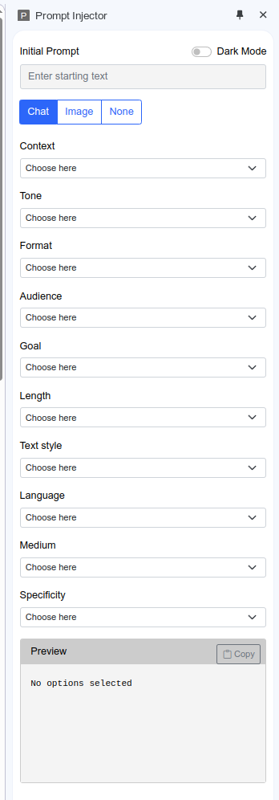
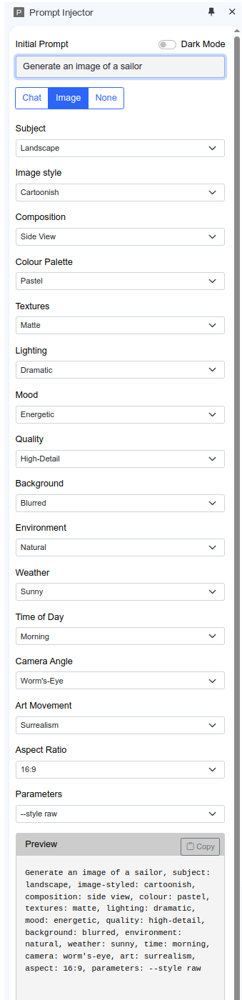
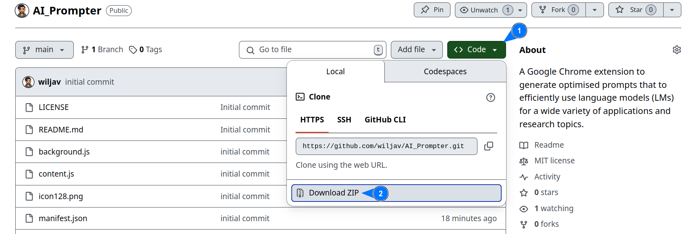
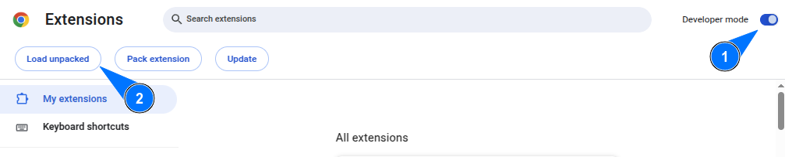

# AI Prompter


A simple Google Chrome extension to generate optimised prompts that to efficiently use language models (LMs) for a wide variety of applications and research topics.

## Overview
The extension has two modes, Chat and Image:


<!--  -->

---

Example:
- Image prompt:

    
    
- Results from [Qwen AI](https://chat.qwen.ai/):

    
    <!--  -->

----

# Installation
1. Download this repository to your PC:
    - Using your browser:

        
    <!--  -->

    - Using Mac/Linux terminal:
        - Install `wget`:

            ```sh
            sudo apt install wget
            ```
        - Download the repository:
            ```sh
            wget -O AI_prompter.zip https://github.com/wiljav/AI_Prompter/archive/refs/heads/main.zip
            ```
1. Extract the extension from the zip file:

1. Load the extension to your browser:
    1. Go to Extension from options in your Google Chrome browser:
        ```sh
        chrome://extensions/
        ```
    1. Enable `Developer mode`
    1. `Load unpacked`:

        
        <!--  -->

---

